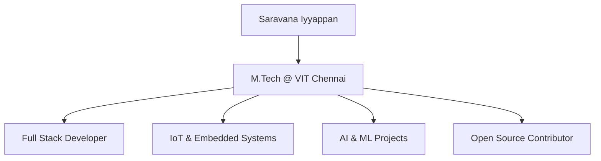

<h1 align="center">
  Hi there 👋 I'm Saravana Iyyappan
</h1>

  

---

## 🚀 About Me

---

## 🧠 Tech Stack

  

---

## 💼 Tools & Platforms

- 🧑‍💻 VS Code, GitHub, Postman, Figma  
- ☁️ Firebase, Vercel, Netlify  
- 🧪 GitHub Actions, Agile, CI/CD  
- 📱 Expo, Android Studio  
- 🤖 OpenAI API, Gemini API

---

## 🌐 Languages I Speak

- **Frontend**: `HTML`, `CSS`, `JavaScript`, `React`, `Next.js`
- **Backend**: `Node.js`, `Express`, `Firebase Functions`
- **Mobile**: `React Native`, `Expo`
- **AI/ML**: `Python`, `NumPy`, `Pandas`, `OpenAI`, `Gemini`,`Prompt Engineering`
- **Database**: `PostgreSQL`, `Firebase Realtime DB`, `MongoDB`, `MySQL`
- **Embedded**: `ESP8266`, `ESP32`, `C`, `IoT protocols`

---

## 📫 Contact Me

- ✉️ saravana.personal.dev@gmail.com  
- 🌐 [LinkedIn](https://www.linkedin.com/in/saravana-iyyappan/) | [GitHub](https://github.com/DeluluSaro)  
- 📱 React Native | 💻 Next.js | ⚡ Firebase  

---

⭐️ *Thanks for visiting! Feel free to follow, fork, or star my projects. Let's build something amazing together!*
